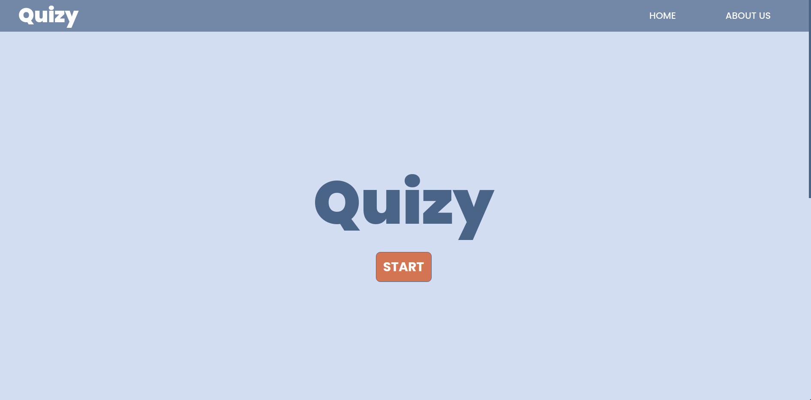
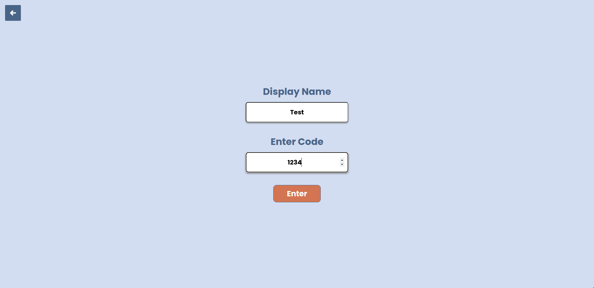
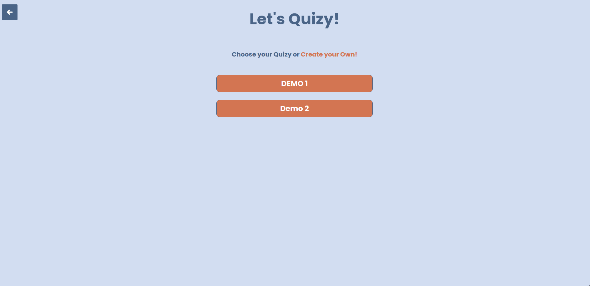

# Quizy
## Description
Simple Live Quiz/Trivia app.
Forked from [iZip](https://github.com/Takezooo/iZip-Kahoot-Clone)

## Environment setup
Create a `.env` file, and fill the `MongoURL`

```sh
MongoURL="mongodb+srv://<username>:<password>@<DBURL>"
```

## Instructions
- Install MongoDB: `sudo apt-get install mongodb`
- Start MongoDB: `Sudo service mongodb start`
- Install node modules: `npm install`.
- Start Server: `nodejs server/server.js`

## UI







